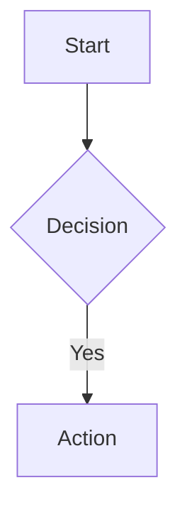

# Mintlify Documentation Project

## IMPORTANT: Always Use the Mintlify Skill

**Before creating, editing, or updating any documentation page or content, you MUST invoke the `mintlify` skill first.** This ensures you follow current Mintlify best practices, component syntax, and conventions.

```
Skill(mintlify)
```

Use the skill for: creating new pages, updating existing pages, adding components, configuring navigation, setting up API references, or any content changes to the knowledge base.

## Project Overview

This is a Mintlify documentation site. Pages are written in MDX (Markdown + JSX components). Configuration lives in `docs.json`.

## Commands

- `mint dev` — Start local dev server at http://localhost:3000
- `mint dev --port 3001` — Use a custom port
- `mint broken-links` — Check for broken internal links
- `mint validate` — Validate documentation builds
- `mint a11y` — Check accessibility issues
- `mint rename` — Rename/move files and update references
- `npm i -g mint` — Install Mintlify CLI globally
- `npx mint dev` — Alternative if `mint` is not globally installed
- `SearchMintlify` MCP tool — Search Mintlify docs directly (connected via `.mcp.json`)
- Full docs.json schema: `https://mintlify.com/docs.json` (enables editor autocomplete)

## Project Structure

```
/
├── docs.json              # Site config (navigation, theme, colors, logo)
├── index.mdx              # Landing page
├── snippets/              # Reusable MDX snippets
├── images/                # Static images
├── logo/                  # Light/dark logo SVGs
├── .mcp.json              # MCP server configs (Mintlify search)
└── .claude/
    ├── settings.json      # Project-level Claude settings (tracked in git)
    └── skills/
        └── mintlify/      # Mintlify skill — ALWAYS reference before creating/editing pages
            └── SKILL.md
```

## Writing Conventions

- **File format:** MDX with YAML frontmatter (`title`, `description`)
- **Heading hierarchy:** Start content with h2 (`##`), never h1 (title comes from frontmatter)
- **Voice:** Second person ("you"), active voice, present tense
- **Navigation:** All pages must be listed in `docs.json` `navigation` to appear on the site
- **Internal links:** Use root-relative paths without `.mdx` extension (e.g., `/guides/auth`)
- **Images:** Store in `/images/`, reference as `/images/filename.png`. Max 5MB per file.
- **Code blocks:** Always specify a language tag. Use `{1,3-5}` for line highlighting.
- **Headings:** Sentence case ("Getting started", not "Getting Started")
- **Content:** Search existing docs before creating new pages — update or link instead of duplicating
- **Avoid:** Marketing language ("powerful", "seamless"), filler phrases ("it's important to note"), editorializing ("simply", "just", "easily")

## Frontmatter Fields

```yaml
---
title: "Page Title"              # Required
description: "SEO description"   # Recommended
sidebarTitle: "Short Title"      # Optional sidebar override
icon: "rocket"                   # Font Awesome/Lucide icon
iconType: "solid"                # Icon style variant
mode: "wide"                     # Layout: default | wide | custom | frame | center
hidden: true                     # Hide from sidebar (still accessible via URL)
noindex: true                    # Exclude from search engines
tag: "Beta"                      # Badge label in sidebar
keywords: ["search", "terms"]    # Non-visible search enhancement
openapi: "spec.json GET /users"  # Auto-generate from OpenAPI
deprecated: true                 # Mark API endpoint as deprecated
---
```

**Layout modes:**
- `default` — Sidebar + table of contents
- `wide` — No table of contents, full-width content
- `custom` — Blank canvas (no sidebar/ToC), only navbar. Use for landing pages.
- `center` — No sidebar/ToC, centered content. Good for changelogs.

## Components Reference

### Callouts
```mdx
<Note>Helpful supplementary info</Note>
<Warning>Important cautions and breaking changes</Warning>
<Tip>Best practices and expert advice</Tip>
<Info>Neutral contextual information</Info>
<Check>Success confirmations</Check>
<Danger>Danger callout</Danger>
```

Custom callout: `<Note icon="key" color="#FFC107" iconType="regular">Custom styled</Note>`

### Layout Components
```mdx
<CardGroup cols={2}>
  <Card title="Title" icon="rocket" href="/path" img="/images/card.png" color="#3B82F6">
    Card description
  </Card>
</CardGroup>

<Columns cols={2}>
  <div>Column 1</div>
  <div>Column 2</div>
</Columns>

<Tabs>
  <Tab title="Python" icon="python">Content</Tab>
  <Tab title="JavaScript" icon="js">Content</Tab>
</Tabs>
```

### Sequential Content
```mdx
<Steps titleSize="h2">
  <Step title="Install" icon="download" stepNumber={1}>
    Instructions here
  </Step>
</Steps>

<AccordionGroup>
  <Accordion title="FAQ item" icon="circle-question" defaultOpen={true}>
    Answer content
  </Accordion>
</AccordionGroup>
```

### Media & Display
```mdx
<Frame caption="Caption with **markdown** and [links](/path)" hint="Hint text above">
  
</Frame>

<Icon icon="flag" size={32} color="#FF5733" iconType="solid" />
<Tooltip tip="Hover text">Underlined term</Tooltip>
<Badge color="green">Stable</Badge>
<Latex>E = mc^2</Latex>
```

### Code
````mdx
```python filename.py {1,3-5}
highlighted = "lines 1, 3-5"
```

<CodeGroup>
```bash cURL
curl https://api.example.com
```
```python Python
import requests
```
</CodeGroup>
````

### API Documentation
```mdx
<ParamField path="user_id" type="string" required>
  Unique identifier for the user
</ParamField>

<ResponseField name="data" type="object[]">
  <Expandable title="properties">
    <ResponseField name="id" type="string" required>Unique ID</ResponseField>
  </Expandable>
</ResponseField>

<RequestExample>
```bash
curl -X GET "https://api.example.com/v1/users"
```
</RequestExample>

<ResponseExample>
```json
{ "data": [{ "id": "usr_123" }] }
```
</ResponseExample>
```

### Reusable Snippets

Create in `snippets/` directory. Import with:
```mdx
import MySnippet from '/snippets/my-snippet.mdx';
<MySnippet word="bananas" />
```

Export variables: `export const myVar = "value";`
Import variables: `import { myVar } from '/snippets/vars.mdx';`

Rules: Use arrow functions (`=>`) for JSX snippets, not `function` keyword.

### Mermaid Diagrams
````mdx

````

### AI Prompts
```mdx
<Prompt description="What this prompt does" icon="paperclip" actions={["copy", "cursor"]}>
  You are a helpful assistant...
</Prompt>
```

### Changelog Updates
```mdx
<Update label="January 2026" description="v2.1.0" id="v2-1-0">
  Content with changelog details
</Update>
```

## Configuration (`docs.json`)

### Required
- `$schema`: `"https://mintlify.com/docs.json"`
- `theme`: `mint` | `maple` | `palm` | `willow` | `linden` | `almond` | `aspen` | `sequoia`
- `name`: Project name
- `colors.primary`: Hex color
- `navigation`: Site navigation structure

### Appearance
```json
{
  "appearance": { "default": "system", "strict": false },
  "background": {
    "decoration": "gradient",
    "image": { "light": "/bg-light.png", "dark": "/bg-dark.png" }
  },
  "fonts": {
    "heading": { "family": "Inter", "weight": 700 },
    "body": { "family": "Roboto" }
  },
  "icons": { "library": "fontawesome" }
}
```

Background decorations: `gradient` | `grid` | `windows`
Icon libraries: `fontawesome` (default) | `lucide`

### Navigation Structure
```json
{
  "navigation": {
    "tabs": [{ "tab": "Docs", "groups": [{ "group": "Getting Started", "pages": ["index"] }] }],
    "dropdowns": [{ "dropdown": "Docs", "icon": "book", "groups": [...] }],
    "anchors": [{ "href": "/changelog", "icon": "clock" }],
    "products": [{ "product": "API", "description": "API docs" }],
    "versions": [{ "version": "v2", "default": true }],
    "languages": [{ "language": "en" }, { "language": "es" }]
  }
}
```

### API Playground
```json
{
  "api": {
    "openapi": "openapi.json",
    "playground": { "display": "interactive", "proxy": true },
    "examples": {
      "languages": ["bash", "python", "javascript", "go"],
      "defaults": "all",
      "prefill": true,
      "autogenerate": true
    }
  }
}
```

Playground modes: `interactive` | `simple` | `none` | `auth`

### Analytics Integrations (in `integrations`)
GA4, GTM, PostHog, Amplitude, Mixpanel, Segment, Plausible, Fathom, Pirsch, Hotjar, LogRocket, Heap, Clearbit, Microsoft Clarity, Hightouch, Koala

### Other Config
```json
{
  "navbar": { "links": [...], "primary": { "type": "button", "label": "Dashboard", "href": "..." } },
  "footer": { "socials": { "github": "...", "x": "..." }, "links": [...] },
  "seo": { "indexing": "navigable", "metatags": { "og:site_name": "..." } },
  "search": { "prompt": "Search docs..." },
  "redirects": [{ "source": "/old", "destination": "/new" }],
  "banner": { "content": "New [API v2](/api-v2)!", "dismissible": true },
  "contextual": { "options": ["copy", "view", "chatgpt", "claude", "cursor", "vscode"] }
}
```

## Custom Styling

- Add `.css` files to repo root for global CSS (Pro plan)
- Tailwind v3 utility classes supported (no arbitrary values)
- Add `.js` files for global scripts
- 70+ CSS selectors available: `#navbar`, `footer`, `.sidebar`, `.code-block`, etc.
- Provide light/dark image variants: `className="block dark:hidden"` / `className="hidden dark:block"`

## Git Workflow

- Never use `--no-verify` when committing
- Create new branches for non-trivial changes
- Commit frequently with descriptive messages
- Mark uncertain content with `{/* TODO: Verify ... */}` comments

## Key Rules

- MCP servers go in `.mcp.json` (not `.claude/settings.json`) — use `"type": "http"` with `"url"` for remote servers
- `npx skills add` installs to `.agents/` — copy to `.claude/skills/` if you want git-tracked skills
- Always search existing docs before creating new pages — prefer updating over duplicating
- Every MDX file needs frontmatter with at least `title`
- Pages not in `docs.json` navigation are hidden but still accessible via URL and search
- Cannot use `api` as a top-level folder name (reserved by Next.js)
- Images max 5MB; host larger files on Cloudinary/S3
- API endpoints auto-generate from OpenAPI specs — prefer OpenAPI over manual MDX
- Run `mint dev` to preview changes locally before committing
- Run `mint broken-links` and `mint validate` before pushing
